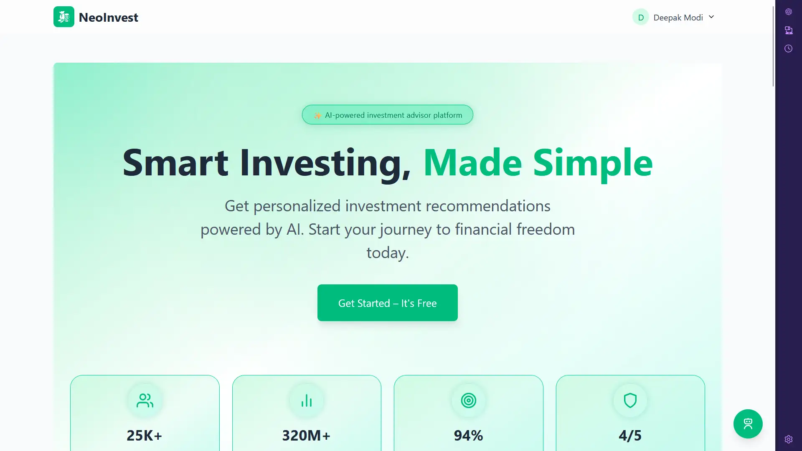

<div align="center">
  
</div>

# 💼 InvestIQ – AI-Powered Investment Assistant

🔗 **Live Demo:** [InvestIQ.vercel.app](https://InvestIQ.vercel.app)

**InvestIQ** is an AI-powered investment platform that helps beginners understand and plan their investments based on risk, capital, age, and financial goals. Powered by **Gemini AI**, real-time gold prices, and a clean UI — InvestIQ explains everything in a way even an 18-year-old can understand.

---

## 🚀 Features

- 🤖 Gemini AI-powered **personalized fund suggestions**
- 📈 **Live gold rate integration** via GoldAPI
- 💬 **AI Chatbot (FunBot)** for financial queries
- 📚 Beginner-focused **blog section** with Gemini-powered summarization
- 🎓 “I’m 18” mode to simplify complex concepts
- 📝 Multi-step **profile form** for goal & risk-based investing
- 🔐 Auth with Appwrite (MVP-ready)
- ⚡ Smooth UX with Framer Motion + Tailwind CSS

---

## ⚙️ Tech Stack

| Category       | Stack                                       |
|----------------|---------------------------------------------|
| **Frontend**   | React, Tailwind CSS, Framer Motion          |
| **Backend**    | Appwrite (Auth & DB), Node.js (planned)     |
| **AI**         | Gemini API (Google AI)                      |
| **APIs**       | GoldAPI (Gold Prices), Hardcoded MF data    |
| **Dev Tools**  | Vite, React Icons, GitHub Actions (optional)|

---

## 🧪 Environment Variables

Create a `.env` file in the root directory and add the following:

```env
VITE_APPWRITE_ENDPOINT=https://cloud.appwrite.io/v1
VITE_APPWRITE_PROJECT_ID=your_appwrite_project_id
VITE_APPWRITE_DATABASE_ID=your_database_id
VITE_APPWRITE_USERS_COLLECTION_ID=your_users_collection_id
VITE_GEMINI_API_KEY=your_gemini_api_key
VITE_GOLD_API_KEY=your_gold_api_key
```

---

## 🛠️ Getting Started

```bash
# 1. Clone the repo
git clone https://github.com/subhashjha/InvestIQ.git
cd InvestIQ

# 2. Install dependencies
npm install

# 3. Add environment variables
cp .env.example .env
# Fill in the actual keys in the .env file

# 4. Run the app locally
npm run dev
```

---

## 📄 License
This project is licensed under the MIT License. See the [LICENSE](LICENSE) file for details.

---

## ⚠️ Disclaimer

This project is a demo and not intended for production use. All information is for educational purposes only. InvestIQ is not a SEBI-registered advisor. Always consult a financial advisor before making investment decisions.

---

## 🙏 Acknowledgements

- [Gemini AI](https://www.gemini.com/) for AI integration
- [GoldAPI](https://www.goldapi.io/) for real-time gold prices
- [Appwrite](https://appwrite.io/) for backend services
- [Vercel](https://vercel.com/) for hosting

---

## 📧 Contact

Questions? Reach out at: subhashkumarjha162@gmail.com

---

## 💬 Feedback

Got feedback or ideas? [Create an issue](https://github.com/jhasubhash620/InvestIQ/issues) or reach out to me !

---

🧠 _“Invest smart, even if you're just starting out.” – InvestIQ_

